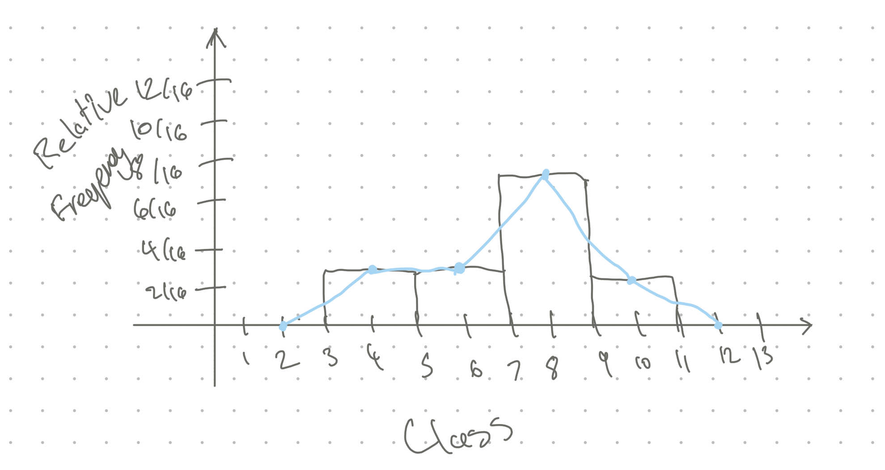
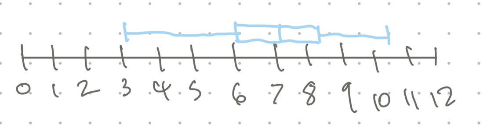

# Assignment 1 - Andrew Chan
## Question 1
The total weight of the four mice will be <u>120</u> grams, give or take <u>5</u> grams or so.  
Calculation:
```
Weight of the 4 mice = 2 * 30g = 120g
```
Standard error for 1 mice is 5g  
  
$$\sqrt{\frac{(5^2) + (5^2) + (5^2) + (5^2)}{4}} = \sqrt{\frac{100}{4}} = 5g$$

## Question 2
In another Harris Poll of 1144 adult Americans, 306 people felt that the U.S. Constitution should be amended to have presidential elections decided by popular vote rather than by the electoral college. Find the statistic <ins>p</ins> and estimate the standard error SEp.  

$$p ≈ \frac{306}{1144} ≈ 27\% $$  
$$ SEp = \sqrt{\frac{\pi(1-\pi)}{n}} = \sqrt{\frac{0.27(1-0.27)}{1144}} = \sqrt{\frac{0.27(0.73)}{1144}} = \sqrt{0.00017229} \approx 0.0131 \approx 1.3\%$$

## Question 3
The symbol for the parameter is <u>π</u>. The value of the parameter is <u>unknown</u>. The collection of 1010 registered voters is called the <u>sample</u>. The symbol for the statistic is <u>p</u>. The value of the statistic is <u>45%</u>. The standard error is approximately <u>1.5%</u>. The 95% margin of error is approximately <u>3%</u>.

$$SEp = \sqrt{\frac{\pi(1-\pi)}{n}} = \sqrt{\frac{0.45(1-0.45)}{1010}} = \sqrt{\frac{0.45(0.55)}{1010}} = \sqrt{\frac{0.24}{1010}} = \sqrt{0.00024} \approx 0.015 \approx 1.5\%$$

## Question 4
(d) 352 is a statistic and 29 is a parameter.

## Question 5
Recall from calculus the techniques of finding maximum values of functions.  
a. Show that the maximum of the function $f(x)=x(1−x)$ occurs when $x=\frac{1}{2}$​.  
b. Use this to prove the inequality in Formula 1.1:
$$\sqrt{\frac{\pi(1-\pi)}{n}} \leq \frac{1}{2{\sqrt{n}}}$$
### (a)
#### Function definition
$$ f(x) = x(1 - x) $$
#### Expand the function
$$ f(x) = x - x^2$$
#### Find the derivative
$$ f(x)' = 1 - 2x $$
#### Find critical points by setting f(x)' = 0
$$ 1 - 2x = 0 => x = \frac{1}{2} $$
#### Check maximum by looking at second derivative
$$f(x)'' = -2 $$  
Since $-2 < 0$, the function is concave down which means that $x = \frac{1}{2}$ is the maximum.
#### Plug the x back in to find the maximum
$$ f(\frac{1}{2}) = \frac{1}{2}(1 - \frac{1}{2}) = \frac{1}{2} * \frac{1}{2} = \frac{1}{4}$$

Therefore the maximum is at $ x = \frac{1}{2}$ and the maximum value is $\frac{1}{4}$

### (b)
#### Use the result from part a
We know that the maximum value of $ \pi(1 - \pi)$ is $ \frac{1}{4}$, and occurs when $ \pi = \frac{1}{2}$
That means that  
$$ \pi(1-\pi) \leq \frac{1}{4} $$
#### Substitute the inequality
Since $$ \pi(1-\pi) \leq \frac{1}{4} $$
We can substitute
$$ \sqrt{\frac{\pi(1-\pi)}{n}} \leq \sqrt{\frac{\frac{1}{4}}{n}} $$
#### Simplify
$$ \sqrt{\frac{\frac{1}{4}}{n}} = \sqrt{\frac{1}{4n}} = \frac{1}{2\sqrt{n}}$$
#### Therefore
$$ \sqrt{\frac{\pi(1-\pi)}{n}} \leq \frac{1}{2{\sqrt{n}}}$$

Therefore the inequality is proven

## Question 6
**If the children who took part in the placebo control study of the Salk vaccine trials were assigned to the vaccine and placebo groups by chance, why weren’t the two groups of the same size?**

Since the vaccine was given to the two groups by chance, this means that the randomness can lead to slight imbalances in group sizes. This is similar to how if you flip a coin 1,000,000 times, you are more likely to NOT get a perfect 500,000 / 500,000. Also, another reason why this could be, is because there is a possibility that there were people who opted out of the vaccine last second, which reduced the number of total children recieving the vaccine. But generally, it is because it is randomaly assigned which creates imperfect ratios.

## Question 7
Below we have the birth weights of 16 babies, measured in pounds:
<table>
  <tr>
    <td>9.2</td>
    <td>6.0</td>
    <td>4.2</td>
    <td>8.7</td>
    <td>3.3</td>
    <td>7.1</td>
    <td>8.0</td>
    <td>6.2</td>
  </tr>
  <tr>
    <td>7.4</td>
    <td>7.1</td>
    <td>3.1</td>
    <td>10.0</td>
    <td>10.5</td>
    <td>6.8</td>
    <td>7.1</td>
    <td>7.2</td>
  </tr>
</table>
Group the data set into a frequency table according to Sturges’s Rule, using classes of equal width. Sketch a histogram and the corresponding frequency polygon.

#### Sturges Rule
$ log_2(16) = 4$ so there will be 4 classes

| Class | Frequency | Relative Frequency |
|----------------|-----------|--------------------|
| 3 - 5      |  3  | 3/16 |
| 5 - 7      |  3  | 3/16 |
| 7 - 9      |  7  | 7/16 |
| 9 - 11     |  3  | 3/16 |



## Question 8
Make a ~~stem~~ box plot and find the five-number summary for the birth weights given in Exercise 2.4 on page 35:
<table>
  <tr>
    <td>9.2</td>
    <td>6.0</td>
    <td>4.2</td>
    <td>8.7</td>
    <td>3.3</td>
    <td>7.1</td>
    <td>8.0</td>
    <td>6.2</td>
  </tr>
  <tr>
    <td>7.4</td>
    <td>7.1</td>
    <td>3.1</td>
    <td>10.0</td>
    <td>10.5</td>
    <td>6.8</td>
    <td>7.1</td>
    <td>7.2</td>
  </tr>
</table>


### 5 Number Summary
Minimum: 3.1
Lower Quartile (Q1): 6.1
Median: 7.1
Upper Quartile (Q3): 8.35
Maximum: 10.5

## Question 9
### Mean
Code I used to calculate the mean:
```python
nums = [3.1, 3.3, 4.2, 6.0, 6.2, 6.8, 7.1, 7.1, 
7.1, 7.2, 7.4, 8.0, 8.7, 9.2, 10.0, 10.5]
acc = 0
for num in nums:
  acc += num

print(acc/len(nums))
```
$$ mean = \bar{x} \approx 6.99375 \approx 6.99 $$
### Standard Deviation
$ \bar{x} = 6.99 $, $ n = 16 $
$$ \sigma = \sqrt{\frac{1}{n-1} \sum_{i=1}^{n}(x_i-\bar{x})^2}$$
$$ \sigma = \sqrt{\frac{1}{n-1}[(3.1-\bar{x})^2 + (3.3-\bar{x})^2 + (4.2-\bar{x})^2 + (6.0-\bar{x})^2 + ... + (10.5-\bar{x})^2]}$$
Code I used to calculate this:
```python
import math
acc = 0
mean = 6.99
nums = [3.1, 3.3, 4.2, 6.0, 6.2, 6.8, 7.1, 7.1, 
7.1, 7.2, 7.4, 8.0, 8.7, 9.2, 10.0, 10.5]
for num in nums:
  acc += (num - mean)**2

result = acc/(len(nums)-1)

print(math.sqrt(result))
```
$$ \sigma \approx 2.1389966 \approx 2.139$$
### Variance
Sample Variance $ \approx (2.139)^2 \approx 4.575 $