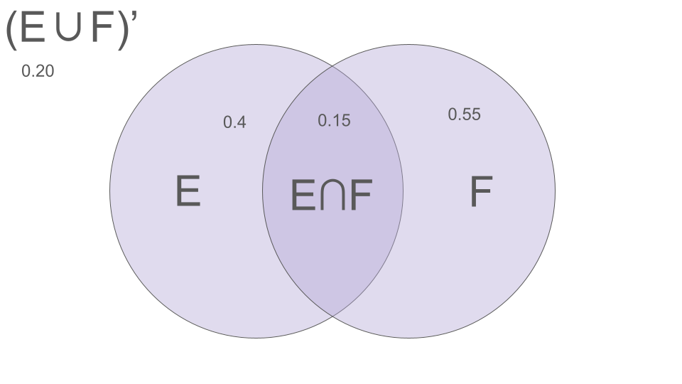
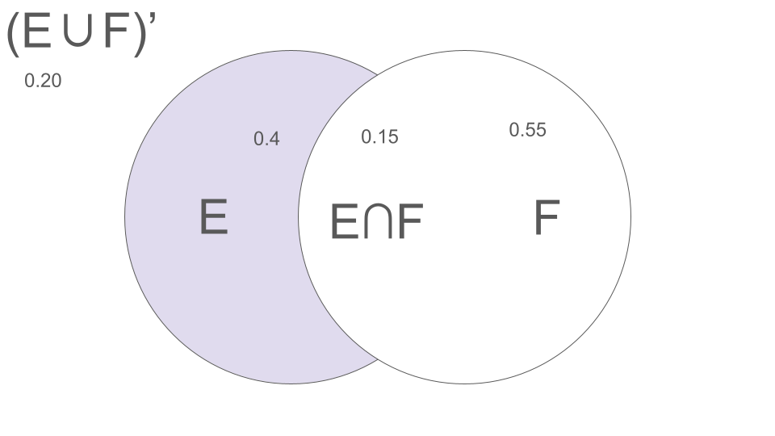
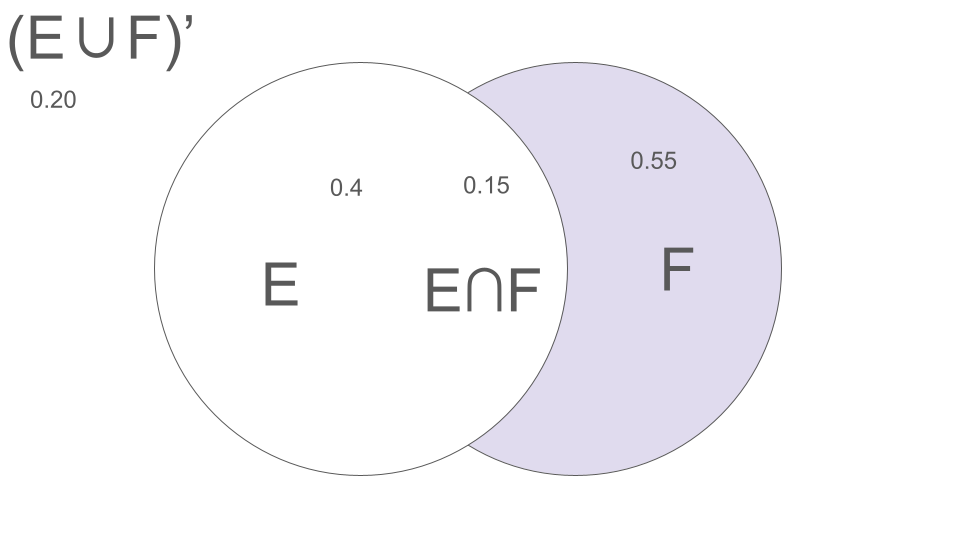
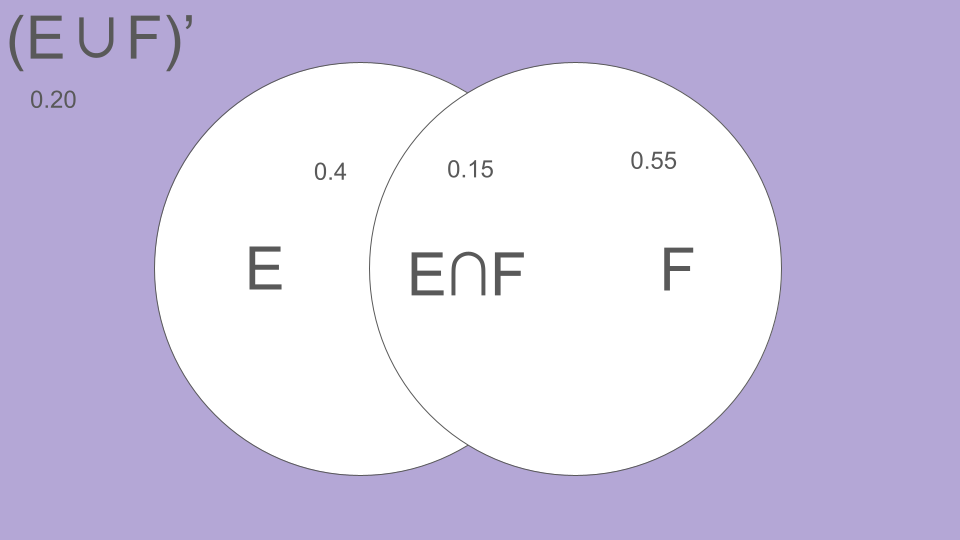

# Assignment 2 - Andrew Chan
## Question 1

Write out all 70 possibilities:  
1: OOOOXXXX
2: OOOXOXXX
3: OOOXXOXX
4: OOOXXXOX
5: OOOXXXXO
6: OOXOOXXX
7: OOXOXOXX
8: OOXOXXOX
9: OOXOXXXO
10: OOXXOOXX  
11: OOXXOXOX
12: OOXXOXXO
13: OOXXXOOX
14: OOXXXOXO
15: OOXXXXOO
16: OXOOOXXX
17: OXOOXOXX
18: OXOOXXOX
19: OXOOXXXO
20: OXOXOOXX  
21: OXOXOXOX
22: OXOXOXXO
23: OXOXXOOX
24: OXOXXOXO
25: OXOXXXOO
26: OXXOOOXX
27: OXXOOXOX
28: OXXOOXXO
29: OXXOXOOX
30: OXXOXOXO  
31: OXXOXXOO
32: OXXXOOOX
33: OXXXOOXO
34: OXXXOXOO
35: OXXXXOOO
36: XOOOOXXX
37: XOOOXOXX
38: XOOOXXOX
39: XOOOXXXO
40: XOOXOOXX  
41: XOOXOXOX
42: XOOXOXXO
43: XOOXXOOX
44: XOOXXOXO
45: XOOXXXOO
46: XOXOOOXX
47: XOXOOXOX
48: XOXOOXXO
49: XOXOXOOX
50: XOXOXOXO  
51: XOXOXXOO
52: XOXXOOOX
53: XOXXOOXO
54: XOXXOXOO
55: XOXXXOOO
56: XXOOOOXX
57: XXOOOXOX
58: XXOOOXXO
59: XXOOXOOX
60: XXOOXOXO  
61: XXOOXXOO
62: XXOXOOOX
63: XXOXOOXO
64: XXOXOXOO
65: XXOXXOOO
66: XXXOOOOX
67: XXXOOOXO
68: XXXOOXOO
69: XXXOXOOO
70: XXXXOOOO

## Question 2
##### Consider the raw data of men’s heights of Example 2.5 on page 27.

a. The mean is **69.148** and the standard deviation is **2.587**

b. Compare the raw data to the three common rules.
The data seems to follow a bell shape distribution. 
68% of the data falls within 1 standard deviation. 
$ 69.148 \pm 2.587 => [66.561, 71.735]$ 
95% of the data falls within 2 stand deviations. 
$ 69.148 \pm 2(2.587) => [63.974, 74.322]$ 
And 99.7% of the data falls within 3 standard deviations. 
$ 69.148 \pm 3(2.587) => [61.387, 76.909]$

c. If one of the men were to be randomly selected and you had to estimate his height, your best guess would be **69.148** inches; your estimate would differ from his actual height by approximately **2.587** inches or so.

d. Compute the estimated standard error.

$$
SE = \frac{s}{\sqrt{n}} = \frac{2.587}{\sqrt{33}} \approx \frac{2.587}{\sqrt{5.744}} \approx 0.4504
$$
Where $s$ is the sample standard deviation and $n$ is the sample size
e. The population mean μ is approximately **69.148** give or take **0.4504** or so.

## Question 3
If a fair die is rolled three times, find the probabilities of the following events:

a. All of the rolls show an even number of dots.
There are 3 even numbers so the chance of rolling an even number once is 3/6 = 1/2. Since we are looking at all three rolls and they are independent of each other, we can multiply the chances all together. 
$ P(\text{all rolls even}) = (\frac{1}{2})^3 = \frac{1}{8}$

b. The last two rolls show an even number of dots.
Using the previous logic the probability for the last 2 rolls are just multiplied together to get
$ \frac{1}{2} \times \frac{1}{2} = \frac{1}{4} $
And since the first roll doesn't matter, it stays as 1/4.

c. The third roll shows an even number of dots.
Only the last roll matters
$ P(\text{last roll even}) = \frac{1}{2} $

d. Every roll shows a single dot.
The probability of rolling a single dot, aka a 1, is 1/6. And since they are all independent we can mutiply all 3 rolls together.
$ P(\text{all single dot}) = (\frac{1}{6})^3 = \frac{1}{216} $

e. Every roll shows the same number of dots.
Since they all have to match and are being rolled one at a time, the means that the first die can be anything. Since it can be anything, it won't effect the probability. So, we can just say that the last two rolls will have a 1/6 chance of matching the first roll, whatever it may be. We can notate it like this
$ P(\text{all rolls match}) = (\frac{1}{6})^2 = \frac{1}{36}$

## Question 4
Sketch a Venn diagram and label the probabilities of the regions 
$E \cup F$, $E \cap F'$, $F \cap E'$, and $(E \cup F)'$, 
if $Pr(E) = 0.40$, $Pr(F) = 0.55$, and $Pr(E \cap F) = 0.15$.

$ Pr(E \cup F) = 0.80 $

$ Pr(E \cap F') = 0.25 $

$ Pr(F \cap E') = 0.40 $

$ Pr((E \cup F)') = 0.20$

## Question 5
Suppose that the outcome set of an experiment is the set of positive integers and the events are all possible subsets of the integers. For each positive integer $i$, let $E_i$ be the event that $i$ is the outcome. Prove from the axioms of probability that it is impossible for to have $Pr(E_i) = p$ for all $i$, where $p$ is a fixed constant value.

**Step 1**
$ S = \{1, 2, 3, ...\} $
Each outcome $i$ is representated by the event $E_i$ where $E_i$ = $\{i\}$
Assume $ P(E_i) = p $, a constant probability for all $i$

From the **axioms of probability**, we know:
1. Axiom 2: $ P(S) = 1 $
2. Axiom 3: $ P(S) = \sum_{i=1}^{\infty}P(E_i)$, since $E_1, E_2, ...$ are disjoint events. 

**Step 2**
1. Substituting $P(E_i) = p$ into the formula for $P(S)$, we get:
$ P(S) = \sum_{i=1}^\infty P(E_i) = \sum_{i=1}^\infty p. $
2. Since $p$ is constant, the summation simplifies to:
$ P(S) = p + p + p + ... = \sum_{i=1}^\infty p = p \cdot \infty. $
3. This result means that $P(S)$ diverges to infinity unless $p=0$.

**Step 3**
Case 1: $p > 0$
If $p>0$, the sum $p \cdot \infty$ becomes infinite
This violates the normalization axiom: $P(S)=1$
Therefore $p>0$ is not possible

Case 2: $p=0$
If $p=0$, the sum becomes $ P(S) = \sum_{i=1}^{\infty}0 = 0$
This violates the normalization axiom: $P(S)=1$
Therefore $p=0$ is also not possible

**Step 4**
Since neither $p>0$ nor $p=0$ satisfies the axioms of probability, it is impossible for $P(E_i) = p$ for all $i$, where $p$ is a fixed constant value. 

## Question 6
An experiment has six possible outcomes. An outcome set for this experiment is $S=\{o1,o2,o3,o4,o5,o6\}$. Suppose the probabilities assigned to the single possible outcome are $Pr(\{o1\})=0.04$, $Pr(\{o2\})=0.20$, $Pr(\{o3\})=0.10$, $Pr(\{o4\})=0.40$, $Pr(\{o5\})=0.20$, and $Pr(\{o6\})=0.06$. Let $A=\{o1,o4,o6\}$, $B=\{o3​,o4​,o5\}$, and $C=\{o2​,o5​\}$ denote three events.

**a**. Which of these events are mutually exclusive?  
By definition, two events are mutually exclusive if the intersection of both of them results in an empty set.  
A and C are mutually exclusive since $A \cap B$ is empty. Also, they have no elements in common. 

**b**. Which are independent?
By definition, two events are independent if $Pr(X \cap Y)=Pr(X)\cdot Pr(Y)$

**Calculate $Pr$**
$Pr(A) = Pr(\{o_1\}) + Pr(\{o_4\}) + Pr(\{o_6\}) = 0.04 + 0.40 + 0.06 = 0.50$
$Pr(B) = Pr(\{o_3\}) + Pr(\{o_4\}) + Pr(\{o_5\}) = 0.10 + 0.40 + 0.20 = 0.70.$
$Pr(C) = Pr(\{o_2\}) + Pr(\{o_5\}) = 0.20 + 0.20 = 0.40.$

**Check independence**  
$Pr(A \cap B) = Pr(\{o_4\}) = 0.40, Pr(A) \cdot Pr(B) = 0.50 \cdot 0.70 = 0.35$

Since $ Pr(A \cap B) \neq Pr(A) \cdot Pr(B) $, $A$ and $B$ are **not independent**.  

$Pr(A \cap C) = 0 \, (\text{mutually exclusive}), Pr(A) \cdot Pr(C) = 0.50 \cdot 0.40 = 0.20$

Since $ Pr(A \cap C) \neq Pr(A) \cdot Pr(C) $, $A$ and $C$ are **not independent**.  

$Pr(B \cap C) = Pr(\{o_5\}) = 0.20, Pr(B) \cdot Pr(C) = 0.70 \cdot 0.40 = 0.28.$

Since $ Pr(B \cap C) \neq Pr(B) \cdot Pr(C) $, $B$ and $C$ are **not independent**.  

Therefore, none of the events are independent.  

**c**. Compute $Pr(B∪C)$.  
Formula:
$Pr(B \cup C) = Pr(B) + Pr(C) - Pr(B \cap C)$
$Pr(B)=0.70$
$Pr(C)=0.40$
$Pr(B \cap C) = Pr(\{o5\}) = 0.20$

$Pr(B \cup C) = 0.70 + 0.40 - 0.20 = 0.90$

$Pr(B \cup C) = 0.90$
