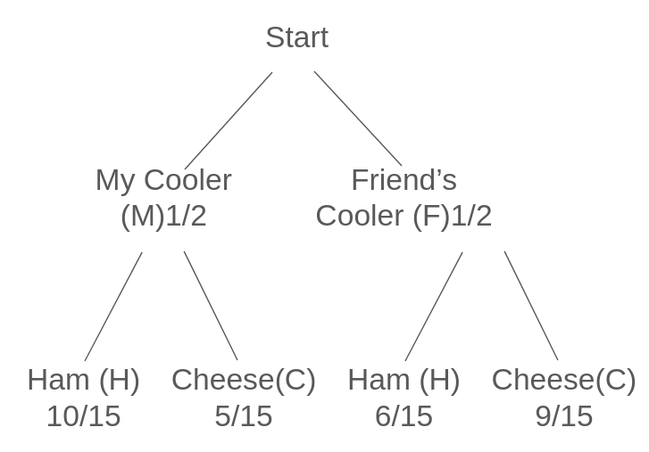

# Assignment 3 - Andrew Chan
## Question 1
The American Cancer Society as well as the medical profession recommend that people have themselves checked annually for any cancerous growths. If a person has cancer, then the probability is 0.99 that it will be detected by a test. Furthermore, the probability that the test results will be positive when no cancer actually exists is 0.10. Government records indicate that 8% of the population in the vicinity of a paint manufacturing plant has some form of cancer. Find $PV^+$ and $PV^-$

$ PV^+ = P(\text{Cancer}|\text{Positive Test})$
$ PV^- = P(\text{No Cancer}|\text{Negative Test})$
$ P(\text{Cancer}) = 0.08 $ (8% of the population has cancer)
$ P(\text{No Cancer}) = 1 - P(\text{Cancer}) = 0.92$
Sensitivity $ P(\text{Positive Test | Cancer}) = 0.99 $
False positive rate $ P(\text{Positive Test | No Cancer}) = 0.10 $
Specificity $ P(\text{Negative Test}|\text{No Cancer}) = 1 - \text{False Positive Rate} = 0.90 $

#### Using Bayes' Theorem for $PV^+$:
$$
PV^+ = \frac{P(\text{Positive Test | Cancer}) \cdot P(\text{Cancer})}{P(\text{Positive Test})}
$$
Use the law of total probability to find $P(\text{Positive Test})$:
$
P(\text{Positive Test}) = P(\text{Positive Test | Cancer}) \cdot P(\text{Cancer}) + P(\text{Positive Test | No Cancer})\cdot P(\text{No Cancer})
$
Substitute the values:
$ P(\text{Positive Test})=(0.99⋅0.08)+(0.10⋅0.92)=0.0792+0.092=0.1712 $
Calculate $PV^+$:
$$
PV^+ = \frac{0.99 \cdot 0.08}{0.1712} = \frac{0.0792}{0.1712} \approx 0.4626 \, (46.26\%)
$$
#### Using Bayes' Theorem for $PV^-$:
$$
PV^- = \frac{P(\text{Negative Test | No Cancer}) \cdot P(\text{No Cancer})}{P(\text{Negative Test})}
$$
Use the law of total probability to find $P(\text{Negative Test})$:
$$
P(\text{Negative Test}) = P(\text{Negative Test | Cancer}) \cdot P(\text{Cancer}) + P(\text{Negative Test | No Cancer}) \cdot P(\text{No Cancer})
$$
Substitute the values:
$
P(\text{Negative Test | Cancer}) = 1 - P(\text{Positive Test | Cancer}) = 1 - 0.99 = 0.01
$
$
P(\text{Negative Test}) = (0.01 \cdot 0.08) + (0.90 \cdot 0.92) = 0.0008 + 0.828 = 0.8288
$

Calculate $PV^-$:
$$
PV^- = \frac{0.90 \cdot 0.92}{0.8288} = \frac{0.828}{0.8288} \approx 0.999 \, (99.9\%)
$$

## Question 2
Let A and B be events with nonzero probability of occurring. Prove that A and B are independent if and only if A and B′ are independent.

Events $A$ and $B$ are independent if:
$ P(A \cap B) = P(A) \cdot P(B) $
$B'$ is the complement of $B$, so $P(B') = 1 - P(B)$.

Forward Direction: If $A$ and $B$ are independent, then $A$ and $B'$ are independent.

Assume $A$ and $B$ are independent:
$P(A \cap B) = P(A) \cdot P(B)$

Using the complement rule:
$P(A \cap B') = P(A) - P(A \cap B)$

Substitute $P(A \cap B) = P(A) \cdot P(B)$:
$P(A \cap B') = P(A) - P(A) \cdot P(B)$

Factorize $P(A)$:
$P(A \cap B') = P(A) \cdot (1 - P(B))$

Since $1 - P(B) = P(B')$, we have:
$P(A \cap B') = P(A) \cdot P(B')$

Therefore, $A$ and $B'$ are independent.

---

Reverse Direction: If $A$ and $B'$ are independent, then $A$ and $B$ are independent.
Assume:
$P(A \cap B') = P(A) \cdot P(B')$

Using the complement rule:
$P(A \cap B) = P(A) - P(A \cap B')$

Substitute $P(A \cap B') = P(A) \cdot P(B')$:
$P(A \cap B) = P(A) - P(A) \cdot P(B')$

Factorize $P(A)$:
$P(A \cap B) = P(A) \cdot (1 - P(B'))$

Since $1 - P(B') = P(B)$, we have:
$P(A \cap B) = P(A) \cdot P(B)$

Thus, $A$ and $B$ are independent.

We have shown that:
1. If $A$ and $B$ are independent, then $A$ and $B'$ are independent.
2. If $A$ and $B'$ are independent, then $A$ and $B$ are independent.

Therefore, $A$ and $B$ are independent and $A$ and $B'$ are independent.

## Question 3
You go to a beach party. Two of you are bringing coolers with sandwiches. Your cooler contains 10 ham sandwiches and 5 cheese sandwiches. Your friend's cooler has 6 ham and 9 cheese sandwiches. At the beach, someone takes a sandwich at random from one of the coolers. It turns out to be a ham sandwich. What is the probability that the sandwich came from your cooler? First, sketch a tree diagram. Then use Bayes' method to compute the probability.

Bayes' Theorem States:
$$P(M | H) = \frac{P(H | M) \cdot P(M)}{P(H)}$$

$P(M∣H)$: Probability the ham sandwich came from your cooler.
$P(H∣M)$: Probability of picking a ham sandwich from your cooler.
$P(M)$: Probability of picking a sandwich from your cooler.
$P(H)$: Total probability of picking a ham sandwich.

$P(M) = P(F) = \frac{1}{2} $
$P(H|M) = \frac{10}{15} = \frac{2}{3}$
$P(H|F) = \frac{6}{15} = \frac{2}{5}$

Using the law of total probability:
$P(H) = P(H∣M) \cdot P(M)+P(H∣F) \cdot P(F)$
Substitute the values:
$P(H) = (\frac{2}{3} \cdot \frac{1}{2}) + (\frac{2}{5} \cdot \frac{1}{2})$
$P(H) = \frac{1}{3} + \frac{1}{5} = \frac{5}{15} + \frac{3}{15} = \frac{8}{15}$

Substitute into Bayes' Theorem:
$P(M | H) = \frac{P(H | M) \cdot P(M)}{P(H)}$
$P(M | H) = \frac{\frac{2}{3} \cdot \frac{1}{2}}{\frac{8}{15}}$

Simplify:
$\frac{2}{3} \cdot \frac{1}{2} = \frac{1}{3}$
$P(M | H) = \frac{\frac{1}{3}}{\frac{8}{15}} = \frac{1}{3} \cdot \frac{15}{8} = \frac{15}{24} = \frac{5}{8}$

Final answer:
$P(M | H) = \frac{5}{8} = 0.625 \, (62.5\%)$