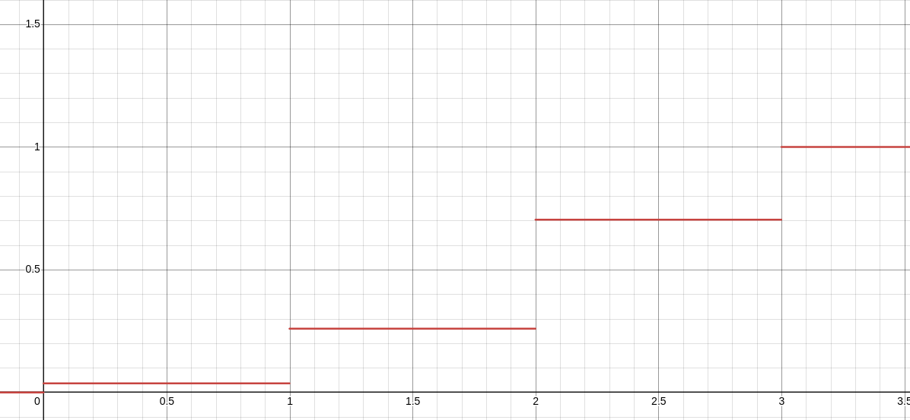
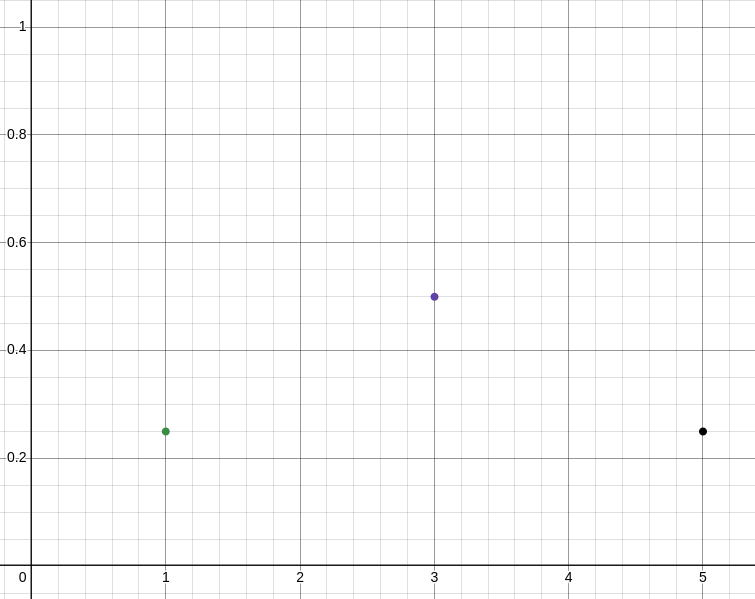
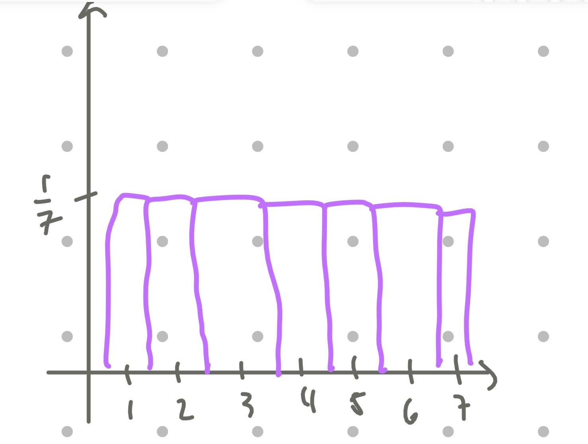

# Assignment 4 - Andrew Chan
## Question 1
Find the cumulative distribution function for the random variable $X$ given by the following table:

$
\begin{array}{|c|c|}
\hline
x & f_X(x) \\ 
\hline
0 & \frac{1}{27} \\ 
1 & \frac{6}{27} \\ 
2 & \frac{12}{27} \\ 
3 & \frac{8}{27} \\ 
\hline
\end{array}
$
$\sum fx(x)=1$

Calculating $F_X(x)$:

- For $x = 0$:
  $$
  F_X(0) = f_X(0) = \frac{1}{27}
  $$

- For $x = 1$:
  $$
  F_X(1) = f_X(0) + f_X(1) = \frac{1}{27} + \frac{6}{27} = \frac{7}{27}
  $$

- For $x = 2$:
  $$
  F_X(2) = f_X(0) + f_X(1) + f_X(2) = \frac{1}{27} + \frac{6}{27} + \frac{12}{27} = \frac{19}{27}
  $$

- For $x = 3$:
  $$
  F_X(3) = f_X(0) + f_X(1) + f_X(2) + f_X(3) = \frac{1}{27} + \frac{6}{27} + \frac{12}{27} + \frac{8}{27} = \frac{27}{27} = 1
  $$

$
F_X(x) =
\begin{cases} 
0, & \text{if } x < 0 \\ 
\frac{1}{27}, & \text{if } 0 \leq x < 1 \\ 
\frac{7}{27}, & \text{if } 1 \leq x < 2 \\ 
\frac{19}{27}, & \text{if } 2 \leq x < 3 \\ 
1, & \text{if } x \geq 3 
\end{cases}
$

## Question 2
Find the probability mass function for the following cumulative distribution function:

$
F(x) =
\begin{cases}
0 & : \text{for } x < 1 \\
0.25 & : \text{for } 1 \leq x < 3 \\
0.75 & : \text{for } 3 \leq x < 5 \\
1 & : \text{for } x \geq 5
\end{cases}
$

The probability mass function: $ f_X(x) $ is derived from the cumulative distribution function: $ F(x) $

1. **For $ x = 1 $:**
   \[
   f_X(1) = F(1) - F(x < 1) = 0.25 - 0 = 0.25
   \]

2. **For $ x = 3 $:**
   \[
   f_X(3) = F(3) - F(x < 3) = 0.75 - 0.25 = 0.5
   \]

3. **For $ x = 5 $:**
   \[
   f_X(5) = F(5) - F(x < 5) = 1 - 0.75 = 0.25
   \]

Final PMF:
$
f_X(x) =
\begin{cases}
0.25 & : x = 1 \\
0.5 & : x = 3 \\
0.25 & : x = 5 \\
0 & : \text{otherwise}
\end{cases}
$

## Question 3
Let $S$ be a random variable for the number of sixes when 2 fair dice are rolled.

(a) Describe Bernoulli random variables $X$ and $Y$ such that $S = X + Y$.

Let $ X $ be a Bernoulli random variable where:
$ X = 1 $ if the first die shows a six.
$ X = 0 $ otherwise.

Let $ Y $ be a Bernoulli random variable where:
$ Y = 1 $ if the second die shows a six.
$ Y = 0 $ otherwise.

The random variable $ S = X + Y $ counts the total number of sixes rolled, which is the sum of $ X $ and $ Y $. This means that there are only 3 possible values for $S$: $0$ if both rolls are not 6. $1$ if only one of the two rolls are sixes (doesn't matter which roll). And $2$ if both rolls are sixes.

(b) Calculate the expected values $E(S)$, $E(X)$, and $E(Y)$.

Expected value of $ X $:
$ X $ is a Bernoulli random variable with $ P(X = 1) = \frac{1}{6} $ (probability of rolling a six on the first die).
The expected value of a Bernoulli random variable is $ E(X) = P(X = 1) \cdot 1 + P(X = 0) \cdot 0 $:
$$
E(X) = \frac{1}{6}.
$$

Expected value of $ Y $:
Similarly, $ Y $ is a Bernoulli random variable with $ P(Y = 1) = \frac{1}{6} $.
The expected value is:
$$
E(Y) = \frac{1}{6}.
$$

Expected value of $ S $:
Since $ S = X + Y $, the expected value of the sum is the sum of the expected values:
$$
E(S) = E(X) + E(Y).
$$
Substituting:
$$
E(S) = \frac{1}{6} + \frac{1}{6} = \frac{2}{6} = \frac{1}{3}.
$$

$ E(X) = \frac{1}{6} $
$ E(Y) = \frac{1}{6} $
$ E(S) = \frac{1}{3} $

## Question 4

Subjects of a clinical trial of an experimental drug treatment are randomly and uniformly assigned to seven dosage levels $U$ labeled 1 through 7.

a. Find the probability function and sketch the probability histogram.

Since the dosage levels $U$ are uniformly assigned to the 7 levels 1 through 7, the random variable $U$ follows a discrete uniform distribution. The probability for each level is equal because it is uniformly distributed throughout.

The probability mass function (PMF) is given by:

$
P(U = u) = \frac{1}{7}, \quad u = 1, 2, 3, 4, 5, 6, 7
$

---

b. Find $\mu$ and $\sigma$.

For a discrete uniform distribution over integers from $1$ to $n$, the mean $\mu$ and standard deviation $\sigma$ are calculated as follows:

Mean ($\mu$):

$
((1 * \frac{1}{7}) + (2 * \frac{1}{7}) + ... + (7 * \frac{1}{7})) = \frac{28}{7} = 4
$

Standard Deviation ($\sigma$):

$
\sigma = \sqrt{E(x)^2 - \mu ^2}
$  
$
\sigma = \sqrt{\frac{1}{7}(1^2 + 2^2 + ... + 7^2) - 4^2}
$  
$
\sigma = \sqrt{\frac{1}{7}(140) - 16}
$  
$
\sigma = \sqrt{20 - 16}
$  
$
\sigma = \sqrt{4} = 2
$  

Therefore:
$
\mu = 4, \quad \sigma = 2
$  

---

c. Find $Pr(\mu - \sigma \leq U \leq \mu + \sigma)$.

This probability is the sum of the probabilities for all $U$ values in the range $[\mu - \sigma, \mu + \sigma]$.

Calculate the range:
$
\mu - \sigma = 4 - 2 = 2, \quad \mu + \sigma = 4 + 2 = 6
$

So, the range is $2 \leq U \leq 6$.

1. The probability of each dosage level is $\frac{1}{7}$. The total probability for $U = 2, 3, 4, 5, 6$ is:

$
Pr(2 \leq U \leq 6) = P(U = 2) + P(U = 3) + P(U = 4) + P(U = 5) + P(U = 6)
$

Since each is $\frac{1}{7}$:

$
Pr(2 \leq U \leq 6) = 5 \times \frac{1}{7} = \frac{5}{7}
$

## Question 5
Joshua decides to play a round of mini-golf (18 holes total). Suppose that his performance on each hole is independent and the number of strokes for each hole can be modeled by the same random variable $S$. The probability mass function of $S$ is given by

$
f_S(1) = \frac{1}{20}, \quad f_S(2) = \frac{1}{4}, \quad f_S(3) = \frac{1}{5}, \quad f_S(4) = \frac{1}{4}, \quad \text{and} \quad f_S(5) = \frac{1}{4}.
$

(a) Compute the expectation, variance, and standard deviation of $S$.

We can calculate the expectation as:

$
\sum_{i} x_i \cdot f(x_i) = 1 \cdot \frac{1}{20} + 2 \cdot \frac{1}{4} + 3 \cdot \frac{1}{5} + 4 \cdot \frac{1}{4} + 5 \cdot \frac{1}{4}
$  
$
\sum_{i} x_i \cdot f(x_i) = \frac{1}{20} + \frac{2}{4} + \frac{3}{5} + \frac{4}{4} + \frac{5}{4} = 3.4
$

Variance $ \text{Var}(S) $:

We can calculate the variance as:

$
\text{Var}(S) = E[(S - \mu)^2] = \sum_{x} (x - \mu)^2 \cdot f_S(x)
$

Substitute $ \mu = 3.4 $ and calculate for each value of $ x $:

$
\text{Var}(S) = (1 - 3.4)^2 \cdot \frac{1}{20} + (2 - 3.4)^2 \cdot \frac{1}{4} + (3 - 3.4)^2 \cdot \frac{1}{5} + (4 - 3.4)^2 \cdot \frac{1}{4} + (5 - 3.4)^2 \cdot \frac{1}{4}
$

Simplify each term:

$(1 - 3.4)^2 = (-2.4)^2 = 5.76 $
$(2 - 3.4)^2 = (-1.4)^2 = 1.96 $
$(3 - 3.4)^2 = (-0.4)^2 = 0.16 $
$(4 - 3.4)^2 = (0.6)^2 = 0.36 $
$(5 - 3.4)^2 = (1.6)^2 = 2.56 $

Multiply by the probabilities:

$
\text{Var}(S) = 5.76 \cdot \frac{1}{20} + 1.96 \cdot \frac{1}{4} + 0.16 \cdot \frac{1}{5} + 0.36 \cdot \frac{1}{4} + 2.56 \cdot \frac{1}{4}
$

Convert to a common denominator of 20:

$
\text{Var}(S) = \frac{5.76}{20} + \frac{1.96 \cdot 5}{20} + \frac{0.16 \cdot 4}{20} + \frac{0.36 \cdot 5}{20} + \frac{2.56 \cdot 5}{20}
$

Simplify:

$
\text{Var}(S) = \frac{5.76}{20} + \frac{9.8}{20} + \frac{0.64}{20} + \frac{1.8}{20} + \frac{12.8}{20}
$

$
\text{Var}(S) = \frac{5.76 + 9.8 + 0.64 + 1.8 + 12.8}{20} = \frac{30.8}{20} = 1.54
$

Standard Deviation $ \sigma $:

The standard deviation is the square root of the variance:

$
\sigma = \sqrt{\text{Var}(S)} = \sqrt{1.54} \approx 1.24
$

(b) Let $T$ be the random variable for the total number of strokes after all 18 holes. Is $T$ the same as $18S$? Why or why not?

Let $ T $ be the total number of strokes for all 18 holes. Since each hole is independent, $ T $ is the sum of 18 independent random variables $ S_1, S_2, \dots, S_{18} $, each with the same distribution as $ S $.

The expectation of \( T \) is:

$
E[T] = 18 \cdot E[S] = 18 \cdot 3.4 = 61.2
$

The variance of $ T $ is:

$
\text{Var}(T) = 18 \cdot \text{Var}(S) = 18 \cdot 1.54 = 27.72
$

The standard deviation of $ T $ is:

$
\sigma_T = \sqrt{\text{Var}(T)} = \sqrt{27.72} \approx 5.26
$

Why $T \neq 18S$:

$T \neq 18S$ because $ T $ is the sum of 18 independent realizations of $ S $, but $ 18S $ would imply that the value of $ S $ is fixed and scaled by 18. This distinction arises because $ T $ accounts for variability over all 18 holes, while $ 18S $ assumes no variability.
